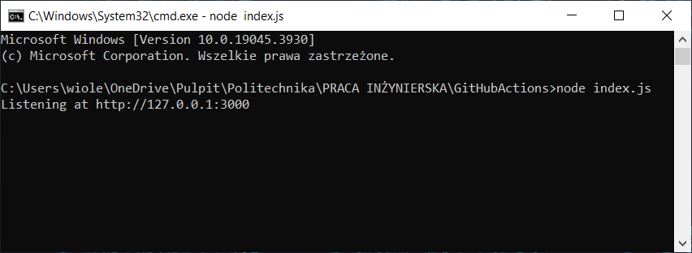

# GitHubActions

## Introduction

The repository contains implemented _GitHub Actions_, which are discussed as part of the engineering thesis. The main goal of the thesis is to discuss the use of _GitHub Actions_ in the development process. _Actions_ were created based on a simple _node.js_ application whose task is to sum natural numbers from 1 to 100.

## Implemented Actions

- **konfiguracja.yml** 

The *konfiguracja.yml* file defines a workflow named *Przykładowe workflow* for demonstrating repository configuration along with a sample workflow. This workflow is triggered whenever there is a push event to the repository.

The workflow includes a job called *compile* that runs on the latest version of Ubuntu. The job consists of three steps:

- The first step uses the **actions/checkout@v3** action to check out the code from the repository.
- The second step, named *Konfiguracja*, runs a command that prints the message *Plik skonfigurowano poprawnie* to indicate that the configuration file is set up properly.
- The third step, named *Dodatkowy krok*, runs a command that prints *Można więc iść dalej*, signaling that the workflow can proceed to the next steps.
This example workflow is designed to show how to configure a repository with a basic setup using GitHub Actions.

- **testmodulowy.yml**

The *testmodulowy.yml* file defines a workflow named _Node.js CI_ for continuous integration using Node.js. This workflow is triggered by push events to the main branch and pull requests targeting the main branch.

The workflow includes a job called _test_ that employs a strategy matrix to test different versions of Node.js (16.x and 18.x) across multiple operating systems (Ubuntu, Windows, and macOS). The job will run on the operating system specified by the matrix.os variable.

The job consists of several steps:

- The first step uses the **actions/checkout@v3** action to check out the code from the repository.
- The second step, named _Cache node modules_, uses the **actions/cache@v2** action to cache the npm modules. It specifies the cache path as `/.npm` and uses a key based on the operating system and the hash of the _package-lock.json_ file. It also specifies restore keys based on the operating system.
- The third step, named _Use Node.js ${{ matrix.node-version }}_, uses the **actions/setup-node@v3** action to set up the Node.js version specified by the **matrix.node-version** variable.
- The fourth step runs `npm ci` to install the project dependencies.
- The fifth step runs `npm run test` to execute the tests defined in the project.

This workflow ensures that the Node.js application is tested across different versions of Node.js and multiple operating systems, providing thorough continuous integration coverage.

- **merging.yml**

The _merging.yml_ file defines a workflow named _Action for merging_ for notifying when a pull request is merged into the main branch. This workflow is triggered when a pull request is closed and the target branch is the main branch.

The workflow includes a single job called _notify-merge_ that runs on the latest version of Ubuntu. This job only executes if the pull request was merged (`github.event.pull_request.merged == true`).

The job consists of two steps:

- The first step, named *Get the name of the merged branch*, retrieves the name of the branch that was merged. It sets this value as an output variable named branch using the expression `${{ github.head_ref }}`.
- The second step, named _Print merge message_, prints a message indicating that the branch was merged with the main branch. It uses the output from the previous step to include the name of the merged branch in the message.
This workflow provides a notification indicating which branch has been successfully merged into the main branch, offering clarity and tracking for merged pull requests.

- **awsdeployment.yml**

The *awsdeployment.yml* file defines a workflow named *Deploy to AWS Elastic Beanstalk* for deploying code to AWS Elastic Beanstalk. This workflow is triggered by push events to the main branch.

The workflow includes a single job called *deploy that runs on the latest version of Ubuntu. The job consists of several steps:

- The first step, named *Checkout code*, uses the **actions/checkout@v2** action to check out the code from the repository.
- The second step, named *Setup Node.js*, uses the **actions/setup-node@v2** action to set up Node.js version 14.
- The third step, named *Install dependencies*, runs the command `npm install` to install the project dependencies.
- The fourth step, named *Run tests*, runs the command `npm test` to execute the tests defined in the project.
- The fifth step, named *Generate deployment package*, runs the command `zip -r package.zip . -x '*.git*'` to create a deployment package, excluding any Git files.
- The sixth step, named *Deploy to AWS Elastic Beanstalk*, uses the **einaregilsson/beanstalk-deploy@v18** action to deploy the package to AWS Elastic Beanstalk. It uses AWS access keys stored in the repository's secrets, specifies the application and environment names (`GitHubActionsApp` and `GitHubActionsApp-env`), the AWS region (`eu-central-1`), the version label (the SHA of the commit), and the deployment package (`package.zip`).
This workflow automates the process of deploying code to AWS Elastic Beanstalk, ensuring that the latest changes are tested and packaged before being deployed to the specified environment.

## Running App

If you want, you can also check the app. As already said, the application calculates the sum of 100 natural numbers starting from 1. The sole purpose of this application is to illustrate how _GitHub Actions_ works. The application has no development use.

### Downloading the repo
1. Make sure you have **Node.js** installed on your computer. You can check this by typing `node -v` in the terminal or command line. If it is not installed, you can download and install it from the [Node.js official website](https://nodejs.org/en).
2. Make sure you have the **git** version control system installed. You can check this by typing `git --version` in the CLI. If it is not installed, you can download it [here](https://git-scm.com/downloads).
3. Create a new folder. Then go to it and right-click. From the context menu, select `Git Bash Here`.
4. In the open `git bash console`, type the following command `git pull https://gith ub.com/WiolaWysopal/GitHubActions.git` and click *Enter*.
5. The repository has been downloaded to your computer.

### Starting the app

1. Open a command line in the repository downloaded to your computer.
2. Install the necessary dependencies by typing `npm install` at the command line.
3. Finally, to run the application, use the `node index.js` command.

4. Open your browser and enter the address obtained after executing the command - in this case it is `http://127.0.0.1:3000`.
5. The running application has been opened in your browser.